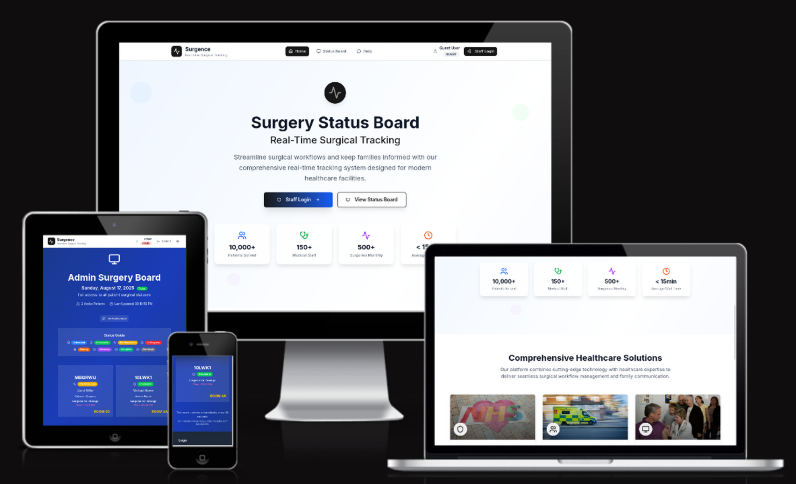

# Surgence - Patient Management System

[Live Link](https://surgence-mu.vercel.app)
[Backend](https://surgence.onrender.com/docs)

---

Surgence is a patient management system designed to assist administrators in managing patient records efficiently. The system allows for the creation, retrieval, updating, and searching of patient information, providing a centralized platform for healthcare data management. It also includes robust user authentication to ensure secure access to sensitive patient data.

## Stack

### Technologies
*   **Backend:** Python, FastAPI
*   **Frontend:** JavaScript, NextJS, TailwindCSS
*   **Database:** PostgreSQL (hosted on Neon.tech)
*   **ORM:** SQLModel
*   **Authentication:** JWT

### Programming Languages

*   Python
*   JavaScript

### Libraries
*   [FastAPI](https://fastapi.tiangolo.com/) - High-performance Python web framework for building APIs.
*   [SQLModel](https://sqlmodel.tiangolo.com/) - ORM library for interacting with SQL databases, built on SQLAlchemy and Pydantic.
*   [Pydantic](https://docs.pydantic.dev/) - Data validation and settings management using Python type annotations.
*   [uvicorn](https://www.uvicorn.org/) - Lightning-fast ASGI server for running FastAPI applications.
*   [asyncpg](https://magicstack.github.io/asyncpg/) - Fast PostgreSQL database client library for Python/asyncio.
*   [python-dotenv](https://saurabh-kumar.com/python-dotenv/) - Loads environment variables from `.env` files.
*   Google Gemini API - AI model for powering the chatbot feature.

*   [Next.js](https://nextjs.org/) - React framework for server-side rendering and static site generation.
*   [React](https://react.dev/) - JavaScript library for building user interfaces.
*   [Tailwind CSS](https://tailwindcss.com/) - Utility-first CSS framework for rapid UI development.
*   [styled-jsx](https://github.com/vercel/styled-jsx) - Full, scoped and component-friendly CSS support for JSX.
*   [tw-animate-css](https://github.com/Wombosvideo/tw-animate-css) - A collection of Tailwind CSS utilities for creating animations.

### Tools

*   [uv](https://github.com/astral-sh/uv) - Fast Python package installer and resolver.
*   [pre-commit](https://pre-commit.com/) - Framework for managing and maintaining multi-language pre-commit hooks.
*   [ruff](https://docs.astral.sh/ruff/) - Extremely fast Python linter and code formatter.
*   [black](https://black.readthedocs.io/) - Uncompromising Python code formatter.
*   [mypy](https://mypy-lang.org/) - Static type checker for Python.
*   [pytest](https://docs.pytest.org/) - Framework for writing and running Python tests.

*   [ESLint](https://eslint.org/) - Pluggable JavaScript linter for identifying and fixing problems in code.
*   [Prettier](https://prettier.io/) - Opinionated code formatter for JavaScript, CSS, and more.
*   [Jest](https://jestjs.io/) - JavaScript testing framework for ensuring code correctness.
*   [Favicon.io](https://favicon.io/) - A tool for generating favicons for your website.
*   [REST Client](https://marketplace.visualstudio.com/items?itemName=humao.rest-client) - VS Code extension for testing HTTP requests.

## Features

*   **User Authentication:** Secure user login and registration with JWT-based authentication.
*   **Patient Management:**
    *   Create, Read, Update, and Delete (CRUD) operations for patient records.
    *   Search for patients by name, status, scheduled date, or surgeon.
    *   Role-based access control to restrict access to patient data.
*   **Chatbot:** An AI-powered chatbot to assist with data interaction and provide information.
*   **Status Tracking:** Track the status of patients and view logs of status changes.

## Chatbot

The chatbot is an integral part of the Surgence platform, designed to provide quick and intuitive access to patient information and system functionalities. It leverages a sophisticated inference engine to understand natural language queries and respond with accurate data or perform requested actions.

### Key Capabilities:

*   **Natural Language Queries:** Interact with the system using everyday language. Instead of navigating complex menus, you can simply ask the chatbot what you need.
*   **Data Retrieval:** Quickly fetch patient records by asking for them by name, ID, or other identifiers. For example, "Find patient John Doe" or "Show me the details for patient #12345."
*   **Information Summarization:** Get concise summaries of patient information, such as their current status, upcoming appointments, or medical history highlights.
*   **Action Execution:** Perform actions like scheduling appointments or updating patient statuses through simple commands. For instance, "Schedule a check-up for Jane Smith next Tuesday" or "Update John Doe's status to 'discharged'."
*   **Guided Assistance:** The chatbot can guide you through various processes, such as registering a new patient or generating a report, by asking for the necessary information step-by-step.

The chatbot is designed to be a powerful assistant, streamlining workflows and making the management of patient data more efficient and user-friendly.

## Deployed Section

The Surgence application is deployed and accessible via the following links:

*   **Frontend (Vercel):** [https://surgence-mu.vercel.app](https://surgence-mu.vercel.app)
*   **Backend (Render):** [https://surgence.onrender.com](https://surgence.onrender.com)

For more detailed deployment information, please refer to the `README.md` files in the `frontend` and `backend` directories of this repository.

## Resources

- NHS Love -  Photo by <a href="https://unsplash.com/@nicolasjleclercq?utm_content=creditCopyText&utm_medium=referral&utm_source=unsplash">Nicolas J Leclercq</a> on <a href="https://unsplash.com/photos/purple-and-pink-heart-shaped-illustration-fbovpZ4GuLg?utm_content=creditCopyText&utm_medium=referral&utm_source=unsplash">Unsplash</a>

- Ambulance - Photo by <a href="https://unsplash.com/@carrier_lost?utm_content=creditCopyText&utm_medium=referral&utm_source=unsplash">Ian Taylor</a> on <a href="https://unsplash.com/photos/yellow-and-white-van-on-road-during-daytime-4hWvAJP8ofM?utm_content=creditCopyText&utm_medium=referral&utm_source=unsplash">Unsplash</a>
- Doctor and Family - Photo by <a href="https://unsplash.com/@cdc?utm_content=creditCopyText&utm_medium=referral&utm_source=unsplash">CDC</a> on <a href="https://unsplash.com/photos/a-group-of-people-standing-in-a-room-OJF3lYjC6vg?utm_content=creditCopyText&utm_medium=referral&utm_source=unsplash">Unsplash</a>

## Team Surgence

- Rodiat Hammed - Project Owner: [GitHub](https://github.com/codefromlani) / [LinkedIn](http://www.linkedin.com/in/rodiat)
- Akashay Anand - Scrum Master: [GitHub](https://github.com/Akashay-Anand) / [LinkedIn](https://www.linkedin.com/in/akashay-anand)
- Tomislav Dukez: [GitHub](https://github.com/tomdu3) / [LinkedIn](https://linkedin.com/in/tomislav-dukez)